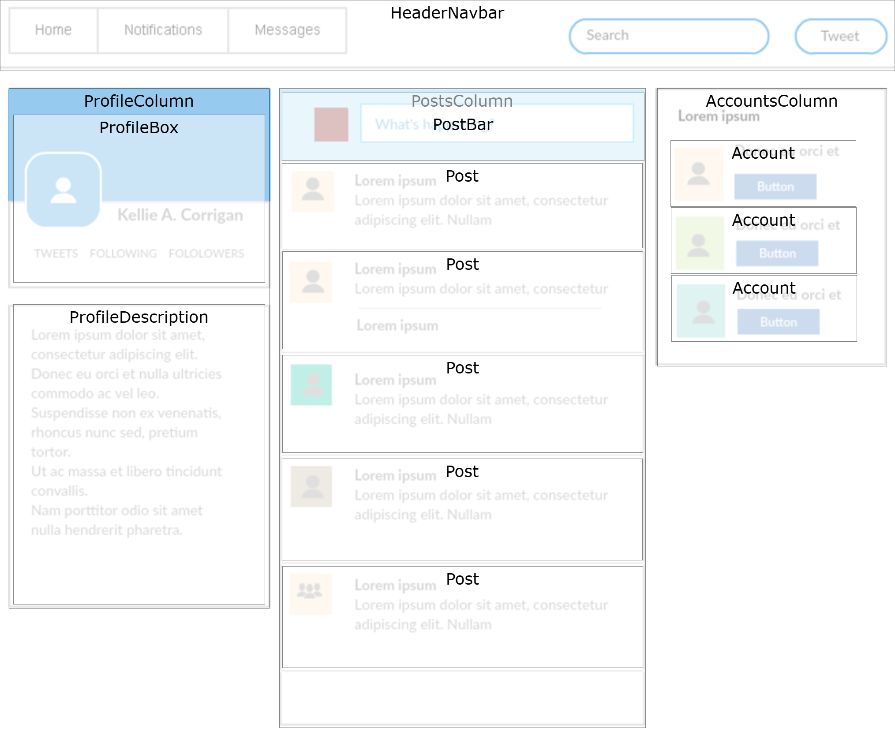

# Social Media Clone

#### By **Samantha Callie**

#### Look at this cool copy

## Technologies Used

* HTML
* CSS
* Bootstrap
* npm
* React

## Description

This site is a recreation of [this image](https://fidgetechcode.org/assets/images/social-media-mockup-3a748e89567bb23a5836504ebe5fcc80.png) using react.

## Component Diagram

## Setup/Installation Requirements

1. Press the green <> Code button and select Download ZIP
2. Unzip file
3. In the top directory, open your terminal (e.g., Terminal or GitBash) and run the command `npm i` (requires npm)

## Available Scripts

In the project directory, you can run:

### `npm start`

Runs the app in the development mode.
Open [http://localhost:3000](http://localhost:3000) to view it in your browser.

### `npm run build`

Builds the app for production to the `build` folder.
It correctly bundles React in production mode and optimizes the build for the best performance..

## Known Bugs

* There are no known bugs at this time

